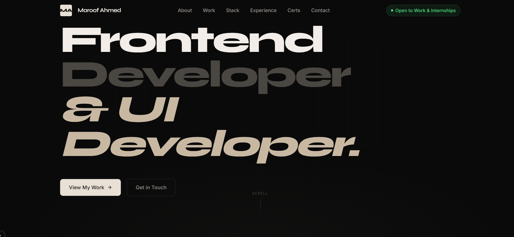
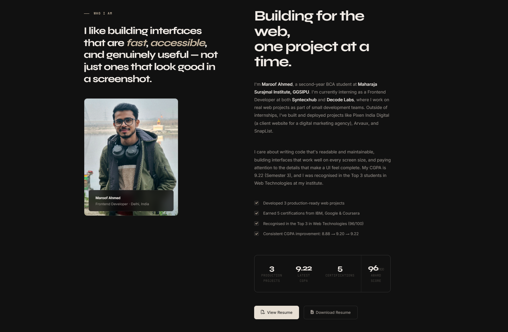
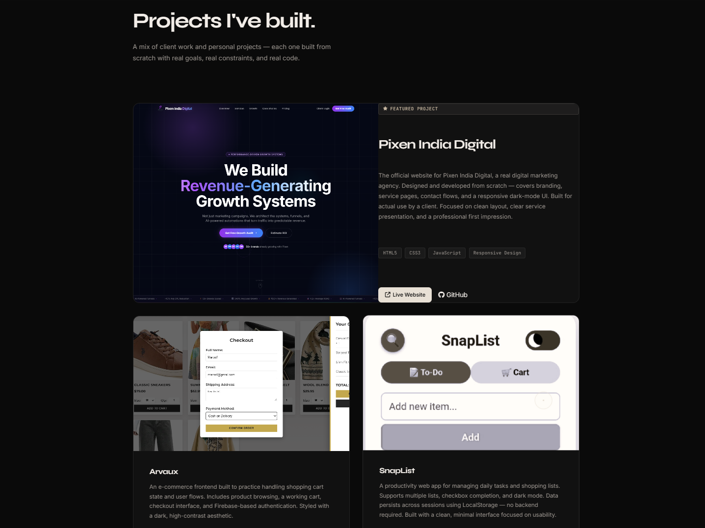
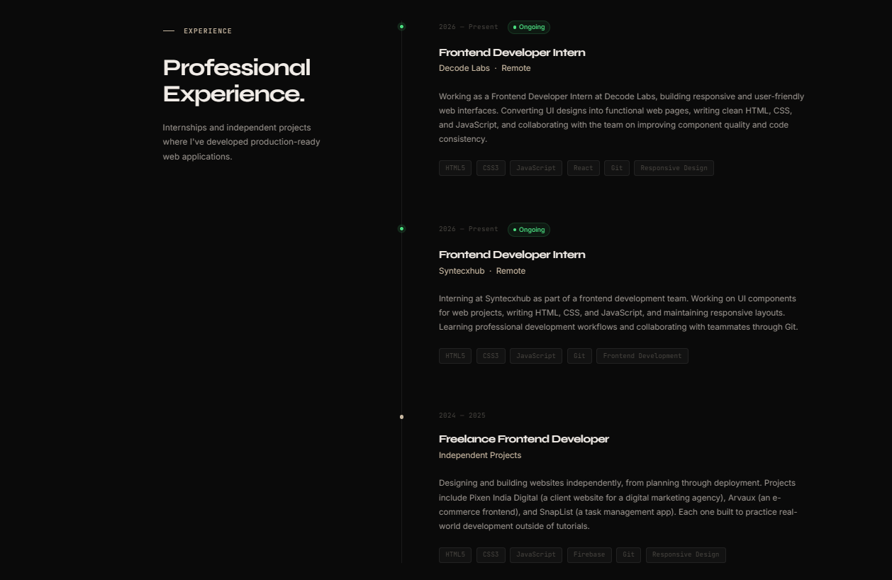
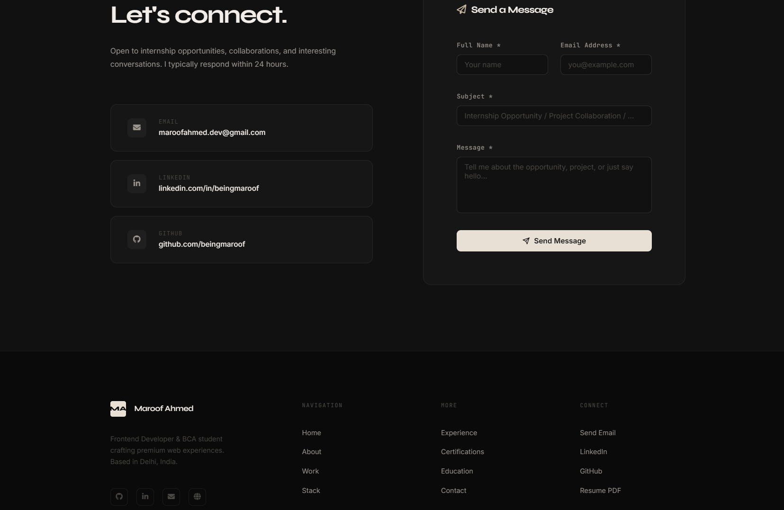

# Maroof Ahmed Portfolio

A personal portfolio website built using HTML, CSS, and JavaScript to showcase my projects, technical skills, internships, certifications, and academic achievements.

The website focuses on clean design, responsive layouts, smooth interactions, and performance while providing a simple way for recruiters and developers to explore my work.

---

## Live Demo

**Portfolio:** https://beingmaroof.github.io/Maroof-Portfolio-Website/

---

## Features

- Responsive design for desktop, tablet, and mobile
- Dark and Light mode
- Smooth GSAP animations
- Scroll reveal animations (AOS)
- Interactive typewriter hero section
- Animated statistics counters
- Filterable skills section
- Professional project showcase
- Internship and experience timeline
- Certification gallery
- Resume download
- Contact form powered by EmailJS
- SEO and social sharing optimized
- Accessible and keyboard-friendly interface

---

## Tech Stack

- HTML5
- CSS3
- JavaScript (ES6)
- GSAP
- AOS
- Typed.js
- Font Awesome
- EmailJS

---

## Featured Projects

### Pixen India Digital
Official website developed for Pixen India Digital, a digital marketing agency. Built as a real business website with responsive layouts, modern UI, and user-focused design.

### Arvaux
Luxury fashion e-commerce website featuring responsive design, product browsing, shopping cart, authentication, and checkout interface.

### SnapList
Task and shopping list application designed for organizing daily tasks with a clean interface and local data storage.

---

## Professional Experience

### Frontend Development Intern
**Syntecxhub**

Working on frontend development using HTML, CSS, JavaScript, and modern development practices while contributing to real-world projects.

### Frontend Development Intern
**DecodeLlabs**

Contributing to frontend development tasks, improving UI components, and building responsive web interfaces.

---

## Certifications

- Google — Discover the Art of Prompting
- Google — Maximize Productivity with AI Tools
- IBM SkillsBuild — Getting Started with Artificial Intelligence
- IBM Skills Network — Prompt Engineering for Everyone
- IBM SkillsBuild — Summarizing Data Using IBM Granite
- Anudip Foundation × EY — IT & Career Readiness

---

## Academic Highlights

- Bachelor of Computer Applications (BCA)
- Maharaja Surajmal Institute, GGSIPU
- Delhi, India
- Current CGPA: **9.22**
- Recognized among the **Top 3 students in Web Technologies**
- Certificate of Appreciation with **96/100** in Web Technologies

---

## Folder Structure

```

Portfolio/
│
├── index.html
│
├── css/
│   ├── style.css
│   ├── animations.css
│   └── responsive.css
│
├── js/
│   ├── main.js
│   ├── animations.js
│   └── contact.js
│
├── assets/
│   ├── images/
│   ├── resume/
│   └── favicon/
│
└── README.md

````

---

## Getting Started

Clone the repository

```bash
git clone https://github.com/beingmaroof/portfolio.git
````

Open the project folder

```bash
cd portfolio
```

Open `index.html` directly in your browser or use Live Server in Visual Studio Code.

---

## Screenshots

### Home



### About



### Projects



### Experience



### Contact



---

## Deployment

The website is deployed using **Vercel**.

Whenever changes are pushed to GitHub, Vercel automatically redeploys the latest version.

---

## Contact

**Name:** Maroof Ahmed

**Email:** [your-email@example.com](mailto:your-maroofahmed.dev@gmail.com)

**Location:** Delhi, India

**Portfolio:** https://your-portfolio.vercel.app

**GitHub:** https://github.com/beingmaroof

**LinkedIn:** https://linkedin.com/in/beingmaroof

---

## Future Improvements

* Blog section
* Project case studies
* Project filtering
* Better accessibility
* Performance improvements
* More frontend and full-stack projects

---

## License

This project is licensed under the MIT License.

The source code may be used for learning purposes. Personal information, branding, projects, images, and content belong to Maroof Ahmed.

---

Developed and maintained by **Maroof Ahmed**.
